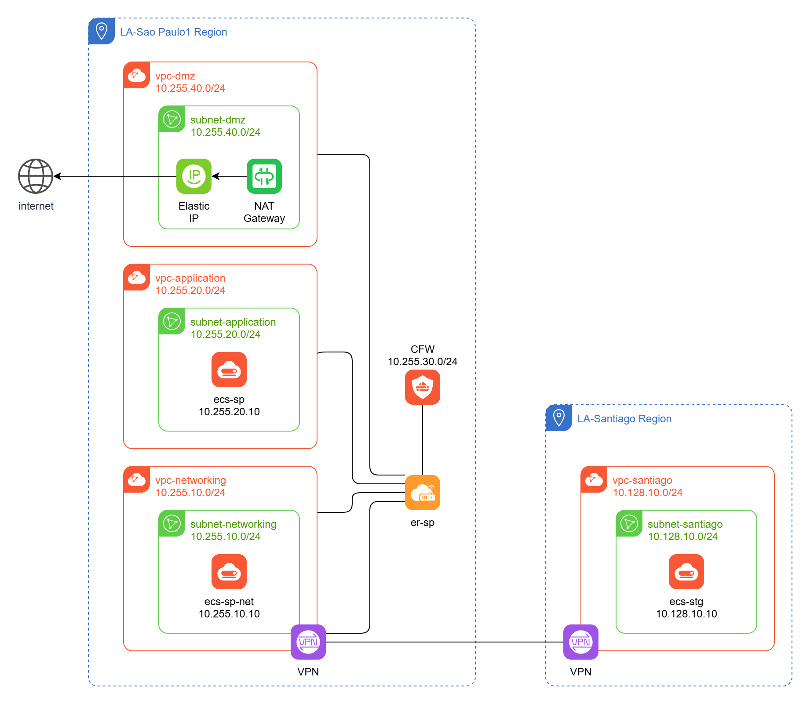
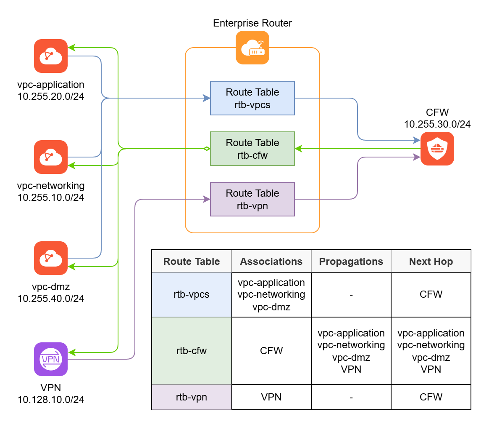

# Huawei Cloud ER + CFW + VPN

This repository contains the Terraform files for a cloud architecture that
uses Enterprise Router (ER) + Cloud Firewall (CFW) + Virtual Private Network
(VPN) + NAT Gateway.

Based on the [Huawei Cloud Terraform Boilerplate][boilerplate].

## Architecture

## References

- [Cloud Firewall (CFW) SNAT Protection Overview][cfw-snat]

[boilerplate]: <https://github.com/huaweicloud-latam/terraform-boilerplate>
[cfw-snat]: <https://support.huaweicloud.com/intl/en-us/bestpractice-cfw/cfw_06_0005.html>
