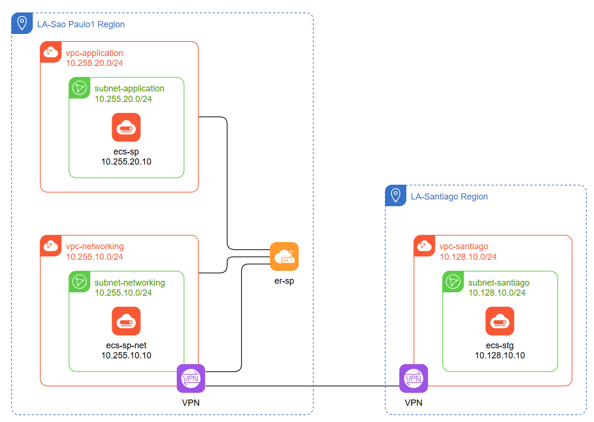

# Huawei Cloud ER + CFW + VPN

This repository contains the Terraform files for a cloud architecture that
uses Enterprise Router (ER) + Cloud Firewall (CFW) + Virtual Private Network
(VPN).

Based on the [Huawei Cloud Terraform Boilerplate][boilerplate].

## Architecture

[boilerplate]: <https://github.com/huaweicloud-latam/terraform-boilerplate>
